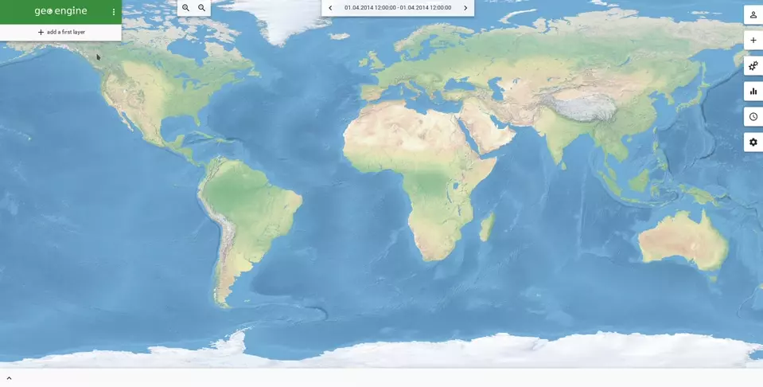
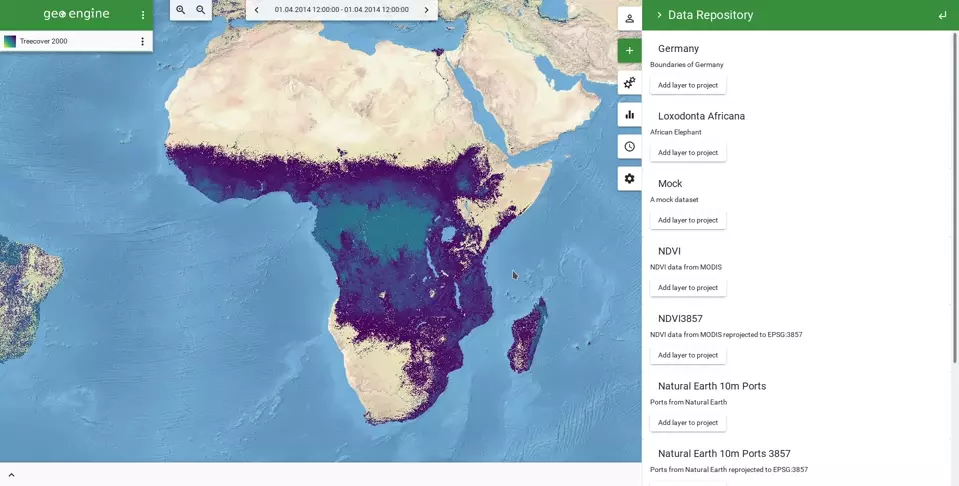
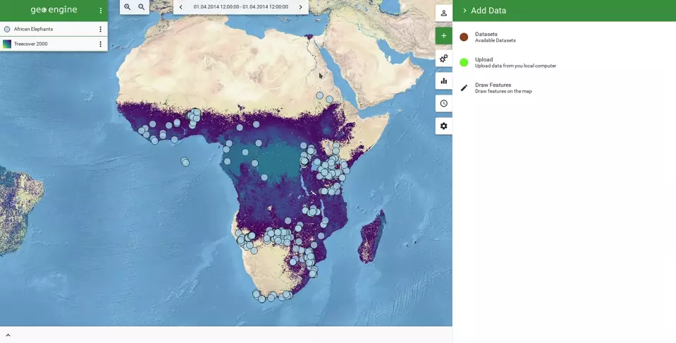
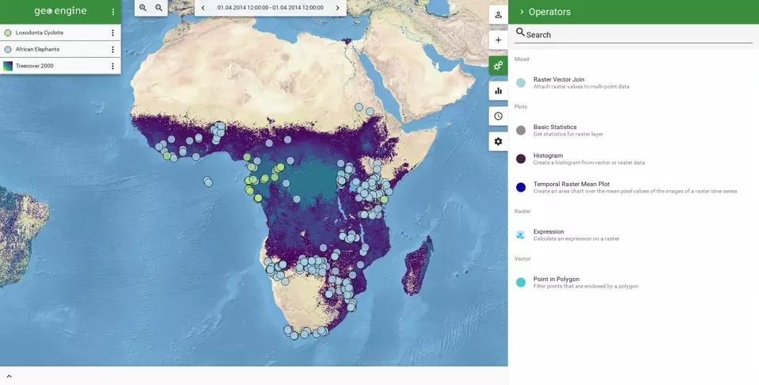
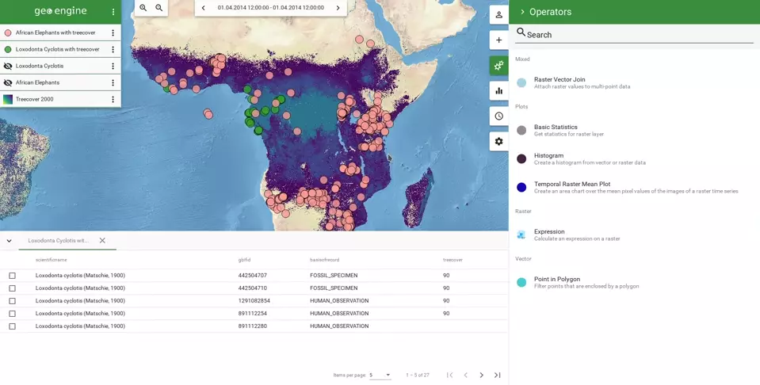
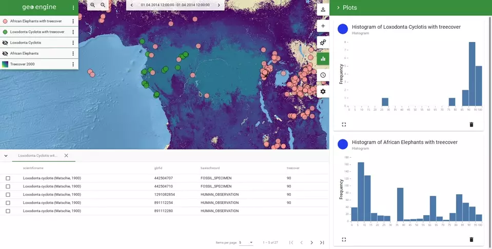

# Explore and Combine Data - The Elephant Use Case

## Short Description

Here, we present a short use case on how to use the Geo Engine to combine observation data with available remote sensing data.
The idea is to map two elephant species, namely the African elephant and the forest elephant.
Then, we want to check a hypothesis that forest elephants live in areas with more forest cover than African elephants.

## Add Raster Data

First, we add a tree cover dataset to the map.
It is derived from the Forest Cover Change dataset from Hansen et al. [1] and is about 50 GB in size.
Since Geo Engine is a server application, we do not need to download any data prior to our analysis.
There are several datasets in our data repository.
We select *Tree Cover 2000* and style it with a more appropriate, greenish color scheme.
The symbology editor presents us with a histogram of values such that it is easy to create a new colorization.

## Add Existing African Elephant Observations

Second, we add a set of African elephant observations to the map.
This data is gathered from several datasets from GBIF [2].
Since our focus area is Africa and there are several points outside Africa, we create a bounding polygon by simply drawing it on the map.
This polygon is quickly added as a new, private dataset and can be used for a point-in-polygon filter operation.
After filtering the elephant observations, we are set with our cleansed data.

## Add ad-hoc Data of Forest Elephants

In addition to the African elephants, we have observation data of forest elephants on our harddrive in GeoJSON format.
The upload dialog automatically derives all necessary attributes to integrate this dataset.
After checking the configuration, we can name the new dataset and add it directly onto the map.
Now, we directly see the different habitats of the two species.

## Combine Data to attach Forest Information to Elephant Observations

In order to validate our initial hypothesis and our first impressions after seeing the data on the map, we want to assess the forst data statistically.
To do that, we have to combine the raster values of the tree cover dataset with the observation features of the elephant data.
Geo Engine provides an easy functionality to do this and performs a raster-vector-join.
In the data table, we can see the new column of tree cover values.

## Dashboard Functionality with Histograms

Finally, we want to plot the data side by side to see differences.
Thus, we create two histogram plots with the same settings of range and buckets.
This clearly shows the differences in the habitats.
Furhermore, the plots are sensitive to the field of view.
By zooming into specific areas, Geo Engine calculates a new histogram dynamically.

## Workflow Lineage

After finishing the analysis, it is important to review the processing workflow and review the data lineage.
This provides on the one hand a transparent processing log that can be shared and reproduced.
On the other hand, it is possible to use this workflow for calling an API to retrieve the data programmatically.
This allows incorporating Geo Engine workflows into processes, once a analysis is create in an exploratory fashion.

## Summary

This short demonstrator showed a set of features from Geo Engine:
 * Using available data from the data repository
 * Uploading custom data into the system
 * Combining raster and vector data in order to enhance features
 * Dynamically creating plots of data in a dashboard fashion
 * Reviewing and re-using the built processing workflow

### Data Citation

1. Forest Cover is derived from:
  High-Resolution Global Maps of 21st-Century Forest Cover Change
  By M. C. Hansen, P. V. Potapov, R. Moore, M. Hancher, S. A. Turubanova, A. Tyukavina, D. Thau, S. V. Stehman, S. J. Goetz, T. R. Loveland, A. Kommareddy, A. Egorov, L. Chini, C. O. Justice, J. R. G. Townshend
  Science15 Nov 2013 : 850-853 : [doi.org/10.1126/science.1244693](https://doi.org/10.1126/science.1244693)
2. Data from [www.gbif.org](https://www.gbif.org)
   * African elephants: GBIF.org (24 April 2021) GBIF Occurrence Download https://doi.org/10.15468/dl.3ppm63
   * Forest elephants: GBIF.org (24 April 2021) GBIF Occurrence Download https://doi.org/10.15468/dl.rmy38e 
